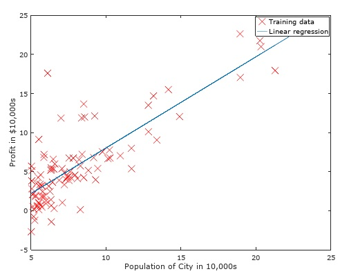

This project implements linear regression with one variable and mulitiple variables.  Linear regression is implemented using Gradient Descent and Feature Normaalization.  It is also implemented using the Normal Equation.

  
 

Starter Code provided by Stanford for the course Maching Learning taught by Andrew Ng through Coursera.
